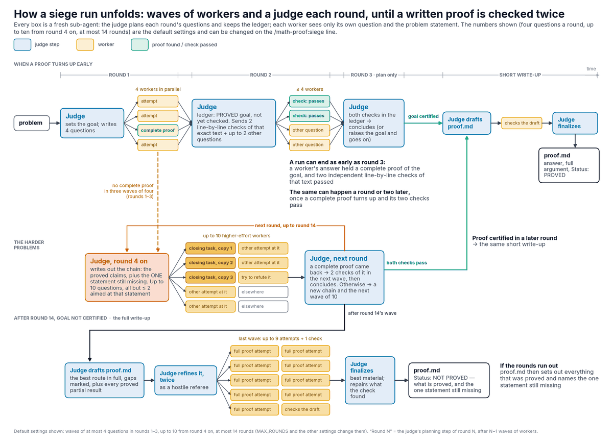

# math-proof

Two Claude Code skills for hard, research-level mathematics problems. Each
takes one problem stated in full, keeps everything it writes in a run folder,
switches web search off for its run, and ends with a self-contained `proof.md`.

**`/math-proof:solo`**: Claude works the problem itself, in your session, as
one long turn. It is instructed to write its plan and each intermediate result
to a notes file before reasoning further, so that a response cut off at the
output limit loses nothing already written. The lighter of the two; try it
first.

**`/math-proof:siege`** (multi-agent): your session does no mathematics itself;
for hours it runs rounds of sub-agents, each starting fresh. Each round a judge
writes a few self-contained questions, independent workers answer them in
parallel, and the judge keeps a ledger of what is proved, refuted and open.
When a worker's answer contains a complete proof (or disproof) of the goal the
judge set, two more workers check that exact text line by line before the judge
concludes; if the opening rounds do not get there, later rounds send more
workers per round, most of them at the one step the proof still lacks.
`proof.md` has a Status section saying plainly what is and is not proved.
Expect dozens of sub-agent runs; check `/usage` before starting.



Either way `proof.md` is the model's own account, citations included: read
it. Full instructions: [skills/solo/SKILL.md](skills/solo/SKILL.md) and
[skills/siege/SKILL.md](skills/siege/SKILL.md); the sub-agents are
defined in [agents/](agents/).

## Install

```
/plugin install math-proof@claude-plugins-official
```

Needs Claude Code 2.1.280 or later, and `python3` for `siege`. Then
add, once, to the `"env"` section of `~/.claude/settings.json` (larger
responses; sub-agents in the foreground; a long timeout for stalled workers):

```json
{
  "env": {
    "CLAUDE_CODE_MAX_OUTPUT_TOKENS": "128000",
    "CLAUDE_CODE_DISABLE_BACKGROUND_TASKS": "1",
    "CLAUDE_ASYNC_AGENT_STALL_TIMEOUT_MS": "14400000"
  }
}
```

## Use

In an empty working directory, one per problem:

```
claude --model claude-opus-5-5 --effort high
> /math-proof:solo <the complete problem statement, or the path of a file holding it>
```

or `/math-proof:siege <…>` likewise. Leave the session alone until it
says where `proof.md` is: `solo` writes under `./math-proof-solo/`,
`siege` under `./math-proof-run/`. To continue a run that stopped or
that you interrupted, give the same line again in the same directory. Options
go before the problem: `DIR=path` picks another run folder, and `siege`
takes settings such as `MAX_ROUNDS=8` (its SKILL.md lists
them); each sub-agent's thinking effort is the `effort:` line in its file in
[agents/](agents/).

Unattended (likewise for `solo`):

```
claude -p "/math-proof:siege $(cat problem.md)" --model claude-opus-5-5 --effort high \
  --permission-mode bypassPermissions --dangerously-skip-permissions
```

**Caution:** `siege`'s judge runs model-written Python through Claude
Code's shell tool on your machine. Use the permission-skipping flags only in a
disposable container or VM, as a non-root user; otherwise approve its commands
by hand.

## License

Apache-2.0; see [LICENSE](LICENSE).
